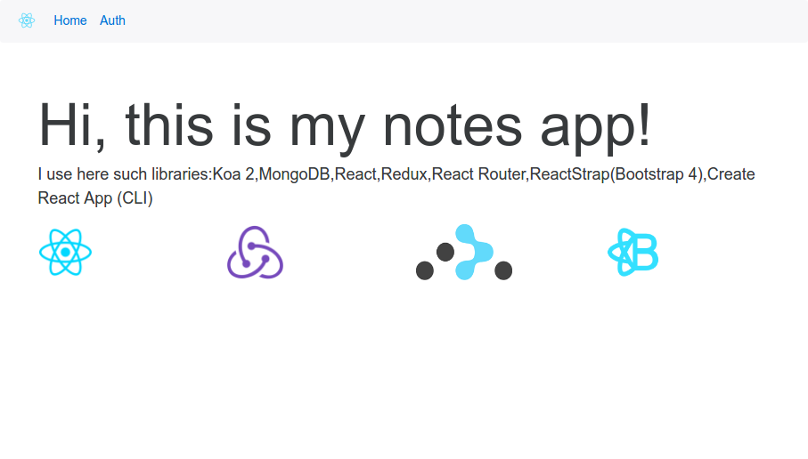
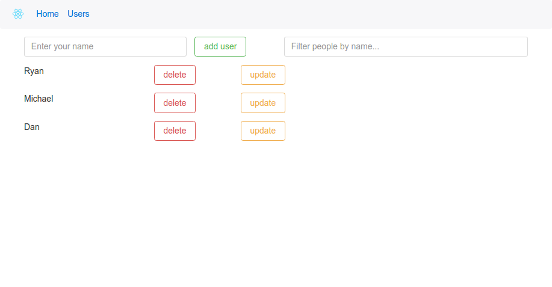

This is my first react application

<ul>
  <li>CRUD operations (add user,view user,update user,delete user)</li>
  <li>filter or search user in state</li>
  <li>routing</li>
</ul>

I use Create React app cli and built app on top of it, also i use ES6 syntax

I used such libs:

<ul>
  <li><a target="_blank" href="https://github.com/facebook/react">React</li>
  <li><a target="_blank" href="https://github.com/ReactTraining/react-router">React router</a></li>
  <li><a target="_blank" href="https://github.com/reactjs/redux">Redux</a></li>
  <li><a target="_blank" href="https://github.com/reactstrap/reactstrap">ReactStrap</a></li>
</ul>

To start propject: clone it,make npm install and npm start

<h2>Result:</h2>

