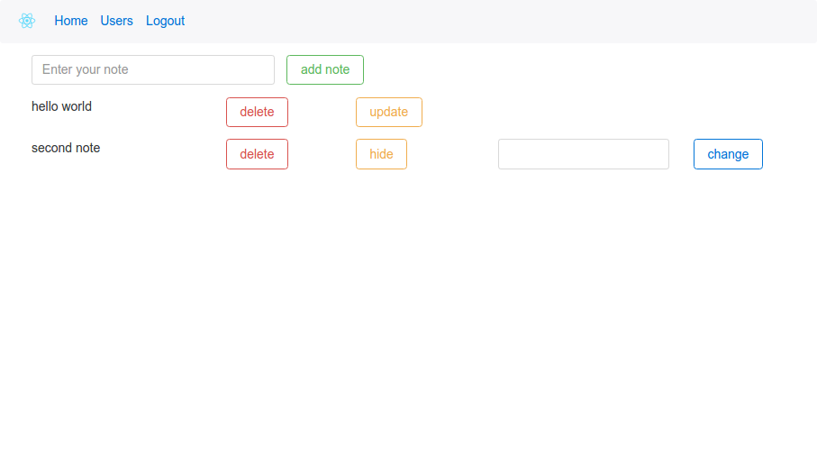

<h3>Backend - in brunch server</h3>
<h3>Frontend - in brunch client</h3>
<h2>Technologies</h2>
<h3>Backend:</h3>

Node.js,Koa 2,MongoDB,Passport.js,Redis, REST API

<h3>Frontend:</h3>

React,Redux,React Router,Redux-thunk,ReactStrap

<h2>Description</h2>

The project is notes app.It allow user add,delete and update notes.

The user can register and authorize (for auth Passport.js local strategy and use jwt token)

<h2>Install instruction(client)</h2>

npm install

npm start

<h2>Screenshots</h2>

